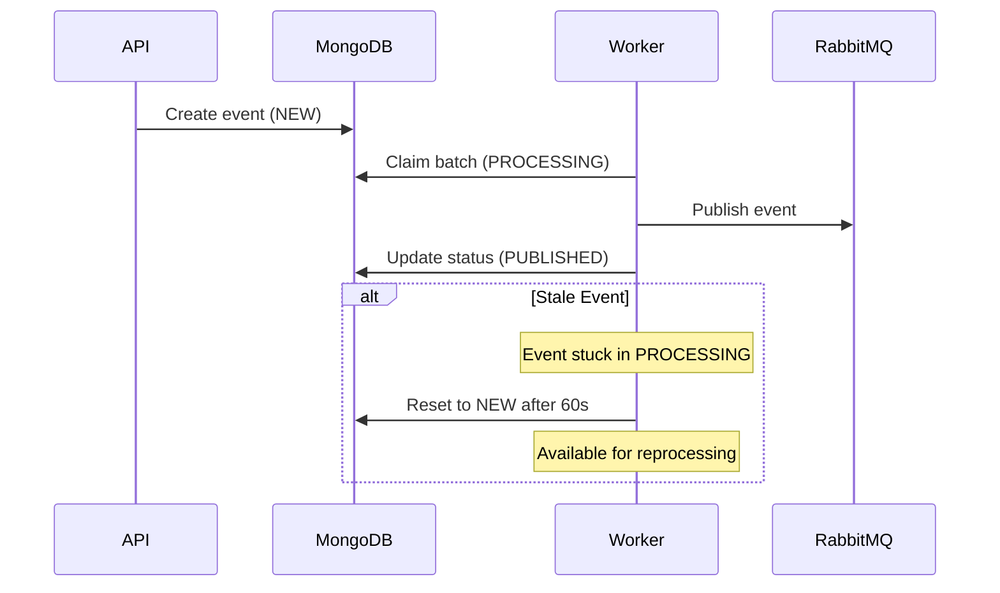

# Event Outbox Pattern Implementation

## Overview

The Event Outbox Pattern is implemented in the worker application to ensure reliable event publishing in a distributed system. This pattern guarantees at-least-once delivery of events to RabbitMQ while maintaining transactional consistency with the database operations.

## Key Components

### Event Schema
Events are stored in MongoDB with the following status progression:
- `NEW` → Initial state when event is created
- `PROCESSING` → Event is claimed by a worker
- `PUBLISHED` → Event has been successfully published to RabbitMQ
- `FAILED` → Event processing failed (optional state for manual intervention)

### Worker Service (`EventsService`)

Located in `apps/worker/src/modules/events/services/events.service.ts`

#### Event Processing Flow

1. **Event Claiming (Every Second)**
   ```typescript
   @Cron(CronExpression.EVERY_SECOND)
   async publishNewEvents()
   ```
   - Atomically claims a batch of `NEW` events (batch size: 500)
   - Updates status to `PROCESSING`
   - Assigns unique `workerId` (format: `hostname-processId`)
   - Sets `processingAt` timestamp

2. **Transactional Processing**
   - For each claimed event:
     1. Starts MongoDB transaction
     2. Publishes event to RabbitMQ (`Exchange.EVENTS`)
     3. Updates event status to `PUBLISHED`
     4. Commits transaction
   
   This ensures that events are only marked as `PUBLISHED` if they are successfully sent to RabbitMQ.

3. **Concurrency Control**
   - Multiple worker instances can run simultaneously
   - Each worker has a unique `workerId`
   - Atomic claiming prevents duplicate processing
   - Status updates check `workerId` to ensure only the claiming worker can update

### Stale Event Recovery

```typescript
@Cron('*/2 * * * *') // Every 2 minutes
async recoverStaleEvents()
```

Handles scenarios where events get stuck in `PROCESSING` state:
- Worker crashed
- Network issues
- Process terminated

#### Recovery Process
1. Identifies events in `PROCESSING` state for > 60 seconds
2. Resets them to `NEW` status
3. Clears `workerId` and `processingAt`
4. Makes them available for reprocessing

## Example Event Flow



## Configuration

- **Batch Size**: 500 events per processing cycle
- **Processing Interval**: Every 1 second
- **Stale Threshold**: 60 seconds
- **Recovery Check**: Every 2 minutes

## Error Handling

1. **Transaction Failures**
   - If RabbitMQ publish fails, MongoDB transaction rolls back
   - Event remains in `PROCESSING` state
   - Will be recovered by stale event recovery

2. **Duplicate Processing**
   - Prevented by atomic claiming
   - Double-checked by `workerId` verification
   - At-least-once delivery semantics

## Monitoring Considerations

Monitor these aspects for system health:
1. Events stuck in `PROCESSING` state
2. High stale event recovery counts
3. Processing latency (time from `NEW` to `PUBLISHED`)
4. Worker instance health (process/host metrics)

## Best Practices

1. **Event Creation**
   - Always create events within the same transaction as the business operation
   - Set initial status as `NEW`

2. **Event Consumers**
   - Implement idempotency
   - Handle duplicate events gracefully
   - Use event ID for deduplication if needed

3. **Scaling**
   - Multiple worker instances can run safely
   - Monitor processing metrics when scaling
   - Adjust batch size and intervals if needed

## Troubleshooting

### Common Issues

1. **High Stale Event Count**
   - Check worker instance logs
   - Verify MongoDB connection health
   - Monitor RabbitMQ connection status

2. **Processing Delays**
   - Review batch size configuration
   - Check MongoDB query performance
   - Monitor RabbitMQ queue metrics

3. **Duplicate Processing**
   - Verify `workerId` uniqueness
   - Check stale threshold configuration
   - Review consumer idempotency implementation 